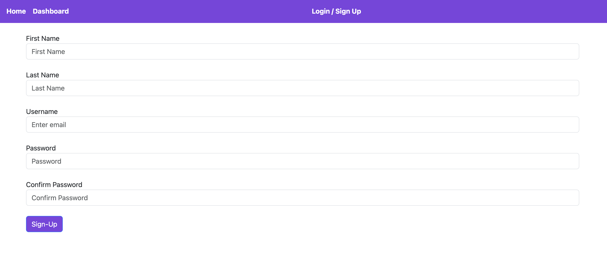
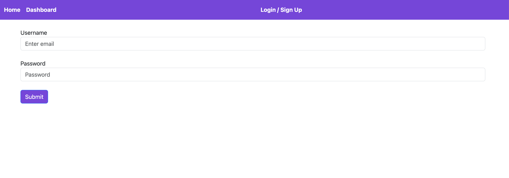
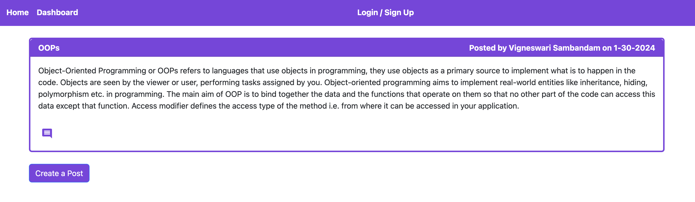
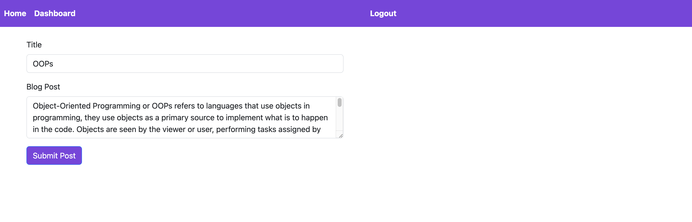
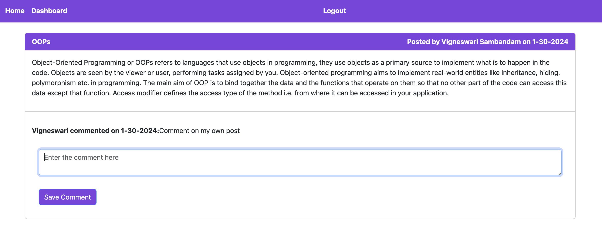

# VSNarrativeNest

## Description

VSNarrativeNest is a full-stack MVC application that allows users to create blog posts. The application allows users to create an account in the portal, and once logged in, they can create, edit, or delete their posts. The home displays all the blog posts irrespective of whether the user has logged in. The dashboard displays all the blog posts of the user who logged in. From home, one can read and comment on the posts. The application handles all the user requests as API requests. The application was developed using server-side technologies like Node.js and Express.js and deployed on the Heroku platform. The application also uses MySQL to store user information and blogs. The application also uses sessions and cookies to store necessary user information.

## Installation

To run or execute the application locally, one must have node installed in the system and other supporting packages like express.js, mysql, etc as mentioned in the package.json file.

To individually install the packages, use the below links,

Follow the guidelines using the link to install Node.js: https://nodejs.org/en/learn/getting-started/how-to-install-nodejs, 

Follow the guidelines using the link to install Express.js: https://www.npmjs.com/package/express

Follow the guidelines using the link to install mysql: https://www.npmjs.com/package/mysql

## Usage

The deployed application can be accessed using the link https://vs-narrative-nest-75a09defd366.herokuapp.com/

The application source code can be accessed using the link https://github.com/Vigneshwarie/VSNarrativeNest

One can download the code from the above link. And to use the application, one must install all node.js, express.js, MySQL and other packages, as mentioned in the installation section or can follow the package.json file and use npm install command. Then, navigate to the db folder and execute the schema and seeds SQL file to create the base database structure for the application to run. Also, before running the application, please ensure that you update your MySQL database credentials for the database in the .env file.

Once completed, navigate to the application folder and run the server.js file in the integrated terminal of vscode. Use the command below to the file,

application-folder> node server.js

On successful installation and execution, the application will run successfully and starts listening to the port. One can navigate to the browser and type localhost for the mentioned port. The application will display as below.

## Credits

The below links were useful in understanding the packages that we used in the application

https://handlebarsjs.com/guide/builtin-helpers.html

https://sequelize.org/docs/v6/advanced-association-concepts/creating-with-associations/

https://getbootstrap.com/docs/5.3/getting-started/introduction/

Sequelize Issue - https://github.com/sequelize/sequelize/issues/9653

## License

Please refer to the LICENSE in the repo.

